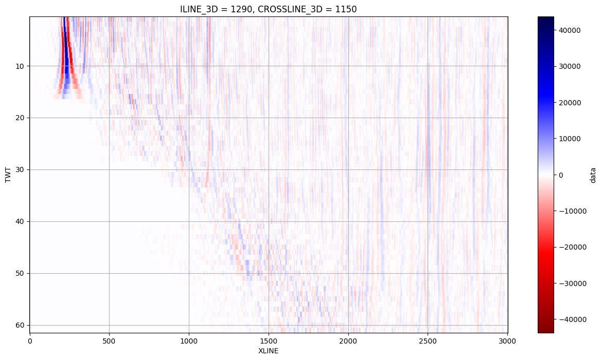

## se complica usar segyio con el archivo unstructured
* no puedo ver iline y xline u otras propiedades

## con un archivo estructurado
* puedo obtener la imagen sismica..
 

* extraer las trazas
* aplicar filtros a las trazas

## objetivos
* realizar la correción NMO y DMO
* aplicar filtro f-k

