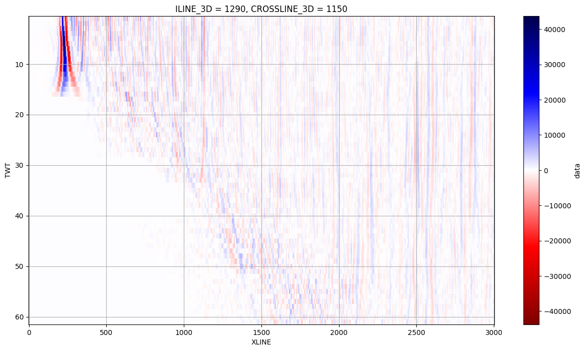

## using segyio
3D images can be visualized (lines)
* iline y xline are not available (None) (they only appear on volumetric representations)
* lines can be plotted using xr, transposing and inverting the array to yaxis

## using segysak
3D files can be visualized per sections

## structured files in 3D
* a single section of the seismic image can be obtained from a structured 3D file..
 

* selecting specifically an inline and a xline especificos
* converting through xr
* it's plotted as a 2D section

## filters
Are applied by:
* extracting traces
* filtering them one by one
* reorganizing the matrix to form the seismic image once it's filtered

## goals
* to make the NMO and DMO corrections
* to apply the f-k filter

## resources
https://data.openei.org/submissions/3794
